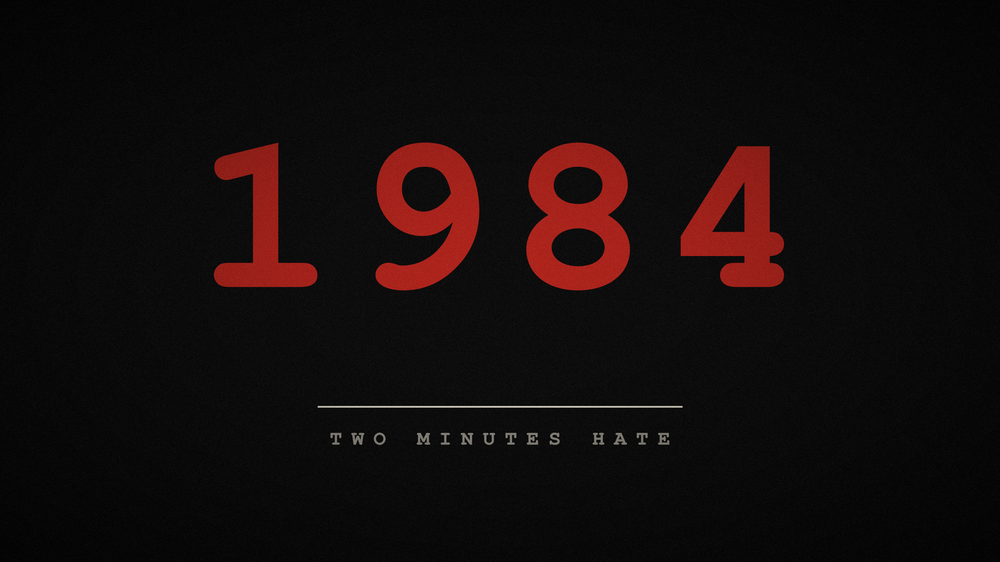

# 1984

Dark, dystopian Omarchy theme inspired by George Orwell's *1984* — muted red accent, warm greys, Newspeak-style minimalism.

## Install

```sh
omarchy theme install https://github.com/NiWe03/omarchy-1984-theme
```

## Preview



## Wallpapers

10 backgrounds themed around the book (Big Brother, Thoughtcrime, Room 101, Ministry of Truth, Newspeak, ...). Images are AI-generated.

## License

MIT, see [LICENSE](LICENSE). Wallpaper images are AI-generated artwork made for this theme, not photographs or third-party work.
